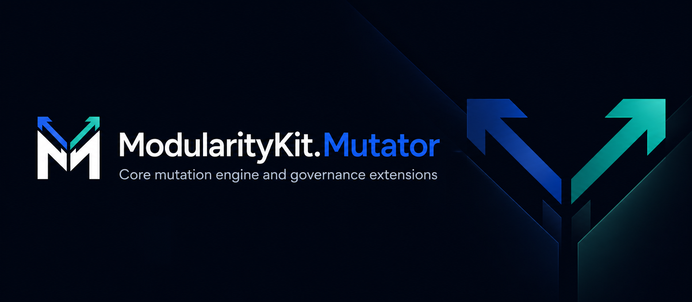
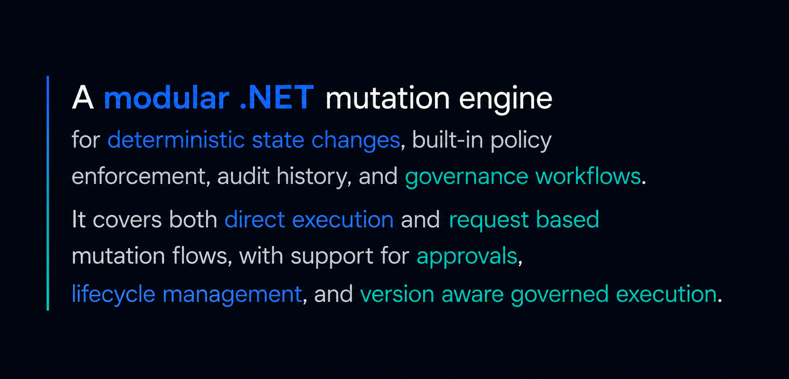

# ModularityKit.Mutator

[](LICENSE)
[](https://dotnet.microsoft.com/)


## Packages

- [`ModularityKit.Mutator`](src/README.md) - core mutation runtime
- [`ModularityKit.Mutator.Governance`](src/Governance/README.md) - request lifecycle, approvals, and governed execution
- [`ModularityKit.Mutator.Governance.Redis`](src/Redis/README.md) - Redis provider for ModularityKit.Mutator.Governance

## Repository

- [`Examples`](Examples/README.md)
- [`Benchmarks`](Benchmarks/README.md)
- [`Docs`](Docs/)
- [`Tests`](Tests/)

## Build

```bash
dotnet build ModularityKit.Mutator.slnx -c Release
```

## Dependency checks

Run these after `dotnet restore ModularityKit.Mutator.slnx`:

```bash
python3 -m scripts.dependencies.check_package_health --solution ModularityKit.Mutator.slnx
```

The check reports vulnerable packages as a failing condition and prints outdated packages for review. When a package needs attention, update the affected `PackageReference` version in the owning project and rerun the check.

## Documentation

Build the DocFX site locally with:

```bash
dotnet tool update -g docfx
docfx docfx.json
```

The generated site includes the conceptual docs under `Docs/` and the public API reference for the
three published packages.

The published site is deployed from `main` to GitHub Pages:

https://modularitykit.github.io/ModularityKit.Mutator/
