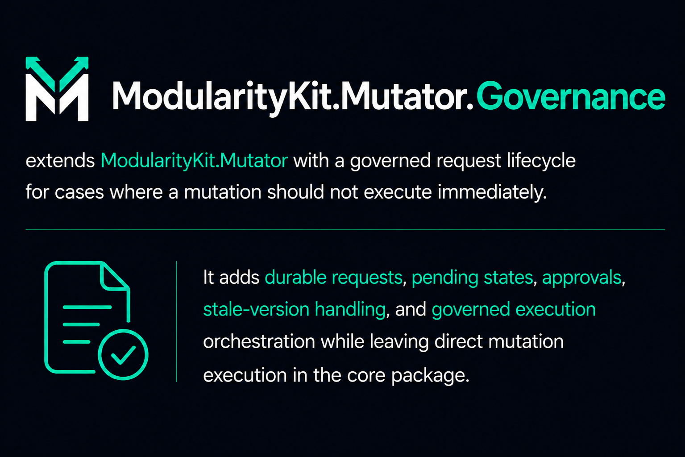
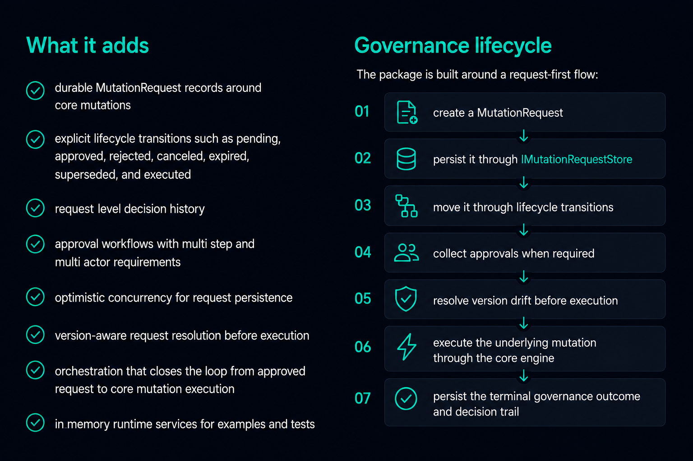

## Quick start

```csharp
using ModularityKit.Mutator.Abstractions.Core;
using ModularityKit.Mutator.Abstractions.Requests;
using ModularityKit.Mutator.Governance.Abstractions.Storage;
using ModularityKit.Mutator.Governance.Runtime.Storage;

var store = new InMemoryMutationRequestStore();

var request = MutationRequestFactory.PendingApproval(
    stateId: "tenant-42:roles",
    stateType: "IamRoleState",
    mutationType: "GrantRoleMutation",
    intent: new MutationIntent
    {
        OperationName = "GrantRole",
        Category = "Security",
        Description = "Grant elevated role to tenant operator"
    },
    context: MutationContext.User("requester-1", "Requester One", "Incident escalation"),
    expectedStateVersion: "v10",
    approvalRequirements:
    [
        MutationApprovalRequirement.SingleActorStep("security-lead"),
        MutationApprovalRequirement.SingleActorStep("platform-owner")
    ]);

var persisted = await store.Create(request);
Console.WriteLine($"{persisted.RequestId} -> {persisted.Status}");
```

## Primary APIs

### Requests

- `MutationRequest`
- `MutationRequestFactory`
- `MutationRequestDecision`
- `MutationRequestStatus`
- `PendingMutationReason`

The request factory also has generic overloads such as `Approved<TState, TMutation>()` and
`PendingApproval<TState, TMutation>()` when you already have concrete CLR types and do not want
to repeat `stateType` / `mutationType` strings at the call site.

### Storage

- `IMutationRequestStore`
- `InMemoryMutationRequestStore`

### Lifecycle

- `IMutationRequestLifecycleManager`
- `MutationRequestLifecycleManager`

### Approval

- `IMutationRequestApprovalWorkflowManager`
- `MutationRequestApprovalWorkflowManager`
- `MutationApprovalRequirement`

### Queries

- `IMutationRequestQueryStore`
- `MutationRequestQuery`
- `MutationApprovalQuery`
- `MutationRequestDecisionQuery`
- `MutationApprovalView`
- `MutationRequestDecisionView`

### Resolution

- `IMutationRequestVersionResolver`
- `IMutationRequestVersionResolutionManager`
- `MutationRequestVersionResolution`
- `MutationRequestVersionResolutionOutcome`
- `VersionedRequestResolutionStrategy`

### Execution

- `IGovernanceExecutionManager`
- `GovernanceExecutionManager`
- `GovernedExecutionResult<TState>`

## Package structure

The project is organized by governance concern:

- `Abstractions/Requests` for request models, decisions, and factory methods
- `Abstractions/Storage` for persistence contracts
- `Abstractions/Approval` for approval requirements and workflow contracts
- `Abstractions/Resolution` for stale-version handling and resolution outcomes
- `Abstractions/Execution` for governed execution contracts and results
- `Runtime` for lifecycle, approval, resolution, execution, and in-memory storage services
- `Abstractions/Exceptions` for governance-specific failures

## Examples

Runnable examples live under [`Examples/Governance`](../../Examples/Governance):

- [`RequestLifecycle`](../../Examples/Governance/RequestLifecycle/README.md)
- [`ApprovalWorkflow`](../../Examples/Governance/ApprovalWorkflow/README.md)
- [`VersionedResolution`](../../Examples/Governance/VersionedResolution/README.md)
- [`GovernedExecution`](../../Examples/Governance/GovernedExecution/README.md)
- [`Queries`](../../Examples/Governance/Queries/README.md)
- [`RedisQueries`](../../Examples/Governance/RedisQueries/README.md)

## Relationship to the core package

`ModularityKit.Mutator` owns mutation execution, policy evaluation, audit, history, side effects, and metrics.

`ModularityKit.Mutator.Governance` owns the request lifecycle around that execution: approvals, pending states, request storage, stale-version resolution, and terminal governance decisions.

It also owns the query-oriented read side for governed requests, approval work, and decision history.

## Current scope

Included today:

- request modeling and decision history
- approval requirements and workflow execution
- optimistic concurrency in request storage
- version-aware resolution before execution
- governed execution orchestration
- in-memory support for local runtime scenarios

Not included yet:

- production persistence providers such as EF Core or PostgreSQL
- reporting/query stores for operational governance views
- compensation or retry orchestration
- external approval system integrations
