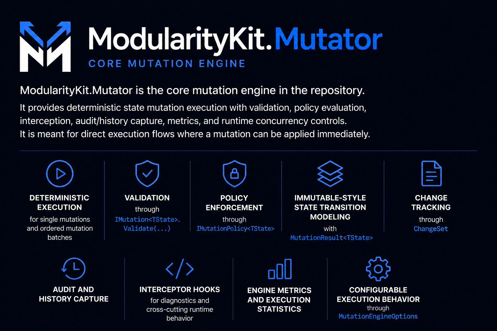
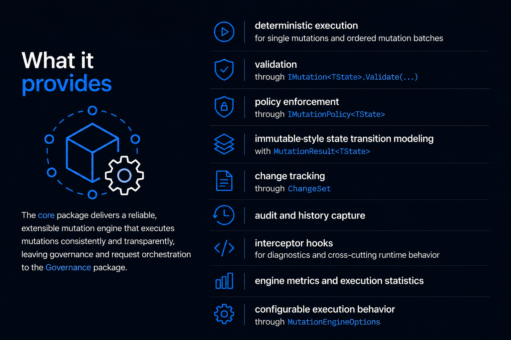

## Quick start

```csharp
using Microsoft.Extensions.DependencyInjection;
using ModularityKit.Mutator.Abstractions;
using ModularityKit.Mutator.Abstractions.Changes;
using ModularityKit.Mutator.Abstractions.Context;
using ModularityKit.Mutator.Abstractions.Engine;
using ModularityKit.Mutator.Abstractions.Intent;
using ModularityKit.Mutator.Abstractions.Policies;
using ModularityKit.Mutator.Abstractions.Results;
using ModularityKit.Mutator.Runtime;

var services = new ServiceCollection();
services.AddMutators(MutationEngineOptions.Strict);

var provider = services.BuildServiceProvider();
var engine = provider.GetRequiredService<IMutationEngine>();

engine.RegisterPolicy(new PreventNegativeQuotaPolicy());

var state = new QuotaState("tenant-42", 10);
var mutation = new IncreaseQuotaMutation("tenant-42", 5);

var result = await engine.ExecuteAsync(mutation, state);
Console.WriteLine(result.NewState!.Quota);

public sealed record QuotaState(string StateId, int Quota);

public sealed class IncreaseQuotaMutation : MutationBase<QuotaState>
{
    public IncreaseQuotaMutation(string stateId, int amount)
        : base(
            CreateIntent(
                operationName: "IncreaseQuota",
                category: "Quota",
                description: "Increase tenant quota"),
            MutationContext.System("Initial quota setup") with { StateId = stateId })
    {
        Amount = amount;
    }

    public int Amount { get; }

    public MutationResult<QuotaState> Apply(QuotaState state)
        => MutationResult<QuotaState>.Success(
            state with { Quota = state.Quota + Amount },
            ChangeSet.Single(StateChange.Modified("Quota", state.Quota, state.Quota + Amount)));

    public ValidationResult Validate(QuotaState state)
        => Amount > 0
            ? ValidationResult.Success()
            : ValidationResult.WithError("Amount", "Amount must be positive.");
}

public sealed class PreventNegativeQuotaPolicy : IMutationPolicy<QuotaState>
{
    public string Name => "PreventNegativeQuota";
    public int Priority => 100;
    public string? Description => "Rejects quota changes that would go negative.";

    public PolicyDecision Evaluate(IMutation<QuotaState> mutation, QuotaState state)
        => PolicyDecision.Allow();
}
```

## Execution model

`IMutationEngine` runs a consistent pipeline around every mutation:

1. evaluate registered policies
2. validate the mutation against current state
3. run interceptors
4. apply the mutation
5. record audit/history data
6. update runtime metrics

Core runtime concurrency is controlled by `MutationEngineOptions.MaxConcurrentMutations`.

- mutations targeting the same `MutationContext.StateId` are serialized
- batch execution remains ordered and sequential
- this is separate from request-storage concurrency in `ModularityKit.Mutator.Governance`

## Primary APIs

### Engine

- `IMutation<TState>`
- `MutationBase<TState>`
- `IMutationEngine`
- `IMutationExecutor`
- `MutationEngineOptions`

### Policies

- `IMutationPolicy<TState>`
- `IPolicyRegistry`
- `PolicyDecision`
- `PolicyRequirement`

### Async policies and external checks

`IMutationPolicy<TState>` supports both synchronous and asynchronous evaluation.

- implement `Evaluate(...)` for lightweight in-process rules
- implement `EvaluateAsync(..., CancellationToken)` for external identity, ticketing, quota, or compliance checks
- the runtime evaluates policies in descending `Priority` order
- sync and async policies can be registered together; they participate in the same priority-ordered pipeline
- when `MutationEngineOptions.PolicyEvaluationTimeout` is set, the timeout is applied per policy evaluation
- caller cancellation still flows through unchanged
- policy failures are surfaced as `PolicyEvaluationException`
- policy timeouts are surfaced as `PolicyEvaluationTimeoutException`

Typical integration cases include:

- external approval evidence checks
- actor/identity resolution against IAM or directory systems
- ticket status validation before execution
- quota lookups in remote control planes
- compliance or risk verification before commit

```csharp
public sealed class RequireApprovedTicketPolicy : IMutationPolicy<QuotaState>
{
    private readonly ITicketGateway _tickets;

    public RequireApprovedTicketPolicy(ITicketGateway tickets)
    {
        _tickets = tickets;
    }

    public string Name => "RequireApprovedTicket";
    public int Priority => 200;
    public string? Description => "Checks ticket approval status before quota changes execute.";

    public async Task<PolicyDecision> EvaluateAsync(
        IMutation<QuotaState> mutation,
        QuotaState state,
        CancellationToken cancellationToken = default)
    {
        var ticketId = mutation.Context.CorrelationId;
        var approved = await _tickets.IsApprovedAsync(ticketId!, cancellationToken);

        return approved
            ? PolicyDecision.Allow(Name, "External ticket is approved.")
            : PolicyDecision.Deny("External ticket is not approved.", Name);
    }
}
```

### Results and changes

- `MutationResult<TState>`
- `BatchMutationResult<TState>`
- `ValidationResult`
- `ChangeSet`
- `StateChange`
- `SideEffect`
- `SideEffectDataContractAttribute`
- `SideEffectDataContractRegistry`

### Typed side effects

Use typed side effect payloads when the emitted data is meant to survive serialization, audit, or downstream integration:

```csharp
[SideEffectDataContract("workflow.started", 1)]
public sealed record WorkflowStartedSideEffectData
{
    public required string Initiator { get; init; }
    public required int StepCount { get; init; }
    public required string WorkflowId { get; init; }
}

SideEffectDataContractRegistry.Register<WorkflowStartedSideEffectData>();

var effect = SideEffect.Create(
    type: "WorkflowStarted",
    description: "Approval workflow started",
    data: new WorkflowStartedSideEffectData
    {
        Initiator = "alice",
        StepCount = 2,
        WorkflowId = "wf-42"
    });
```

The side effect keeps `DataContractType` and `DataContractVersion` alongside `Data`, so persistence and integration layers do not have to guess the payload shape.

### Context and intent

- `MutationContext`
- `MutationIntent`
- `BlastRadius`

### Runtime observability

- `IMutationAuditor`
- `IMutationHistoryStore`
- `MutationHistory`
- `IMetricsCollector`
- `MutationStatistics`
- `IMutationInterceptor`

## Examples

Runnable examples for the core engine live under [`Examples/Core`](../Examples/Core):

- [`BillingQuotas`](../Examples/Core/BillingQuotas/README.md)
- [`FeatureFlags`](../Examples/Core/FeatureFlags/README.md)
- [`IamRoles`](../Examples/Core/IamRoles/README.md)
- [`WorkflowApprovals`](../Examples/Core/WorkflowApprovals/README.md)

## Relationship to governance

`ModularityKit.Mutator` is the direct execution runtime.

If your workflow needs deferred execution, request approval, pending states, or stale-version resolution before the mutation can run, use [`ModularityKit.Mutator.Governance`](Governance/README.md) on top of the core package.

## Current scope

Included today:

- direct mutation execution
- batch execution
- policy evaluation
- validation and failure modeling
- audit/history capture
- metrics and interception
- in-memory runtime components for local and test scenarios

Not included in the core package:

- request lifecycle management
- approval workflow orchestration
- versioned request resolution
- governed request persistence contracts
