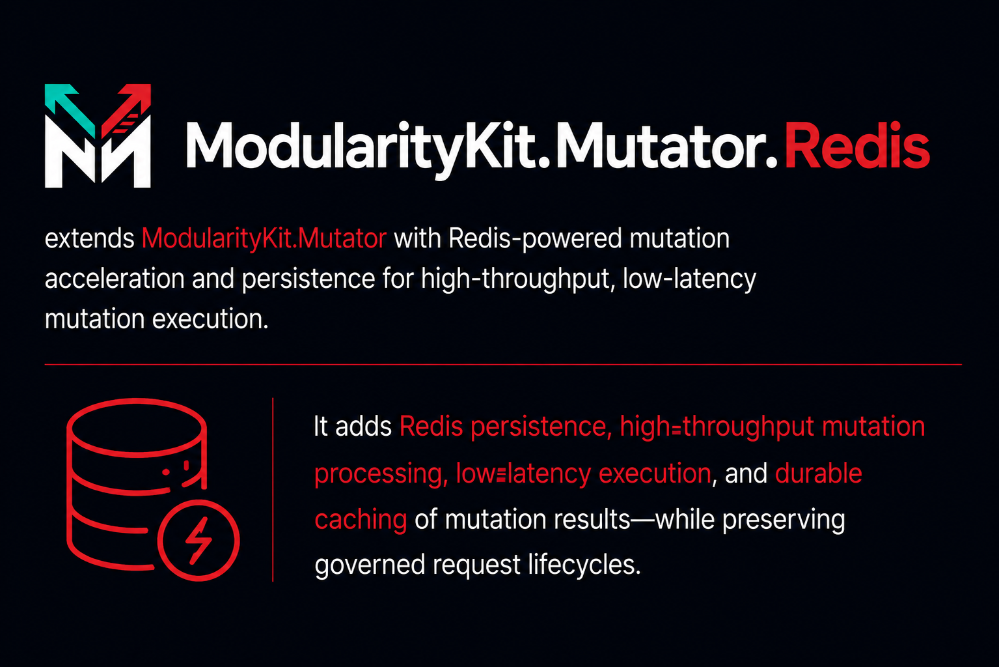

See [`Docs/API/Redis.md`](../../Docs/API/Redis.md) for the practical API surface and usage examples.

## Package structure

- `Configuration` for provider options
- `DependencyInjection` for service registration
- `Keys` for Redis key conventions
- `Storage` for the public store facade
- `Storage/Candidates` for Redis index candidate selection
- `Storage/Candidates/Models` for candidate plan models
- `Storage/Candidates/Planning` for candidate plan construction
- `Storage/Candidates/Execution` for candidate plan execution
- `Storage/Documents` for request document loading
- `Storage/Documents/Keys` for Redis document key creation
- `Storage/Documents/Payloads` for bulk payload reads
- `Storage/Documents/Materialization` for request document deserialization and ordering
- `Storage/Documents/Reading` for document read orchestration
- `Storage/Identifiers` for Redis set and id reads
- `Storage/Identifiers/Models` for identifier set operation models
- `Storage/Identifiers/Loading` for Redis id set loading and normalization
- `Storage/Persistence` for write-side request persistence
- `Storage/Persistence/Models` for persistence record models
- `Storage/Persistence/Reading` for single request persistence reads
- `Storage/Persistence/Writing` for write transactions, payload creation, and index maintenance
- `Storage/Queries` for query orchestration and result materialization
- `Storage/Queries/Reading` for request query orchestration
- `Storage/Queries/Materialization` for query result shaping
- `Serialization` for request payload handling
- `Serialization/Converters` for custom JSON converters

## Usage

```csharp
using Microsoft.Extensions.DependencyInjection;
using ModularityKit.Mutator.Governance.Redis;
using StackExchange.Redis;

var services = new ServiceCollection();
var multiplexer = await ConnectionMultiplexer.ConnectAsync("localhost:6379");

services.AddRedisGovernanceStore(
    multiplexer,
    options => options.KeyPrefix = "modularitykit:governance");
```

## Current query strategy

The provider uses Redis indexes first and then applies the storage-agnostic governance query evaluator in memory for the final filter pass.

Today this means:

- point reads and optimistic concurrency stay fully Redis-backed
- common queue views are narrowed by Redis set membership
- broad ad hoc filters still finish in memory after candidate selection
